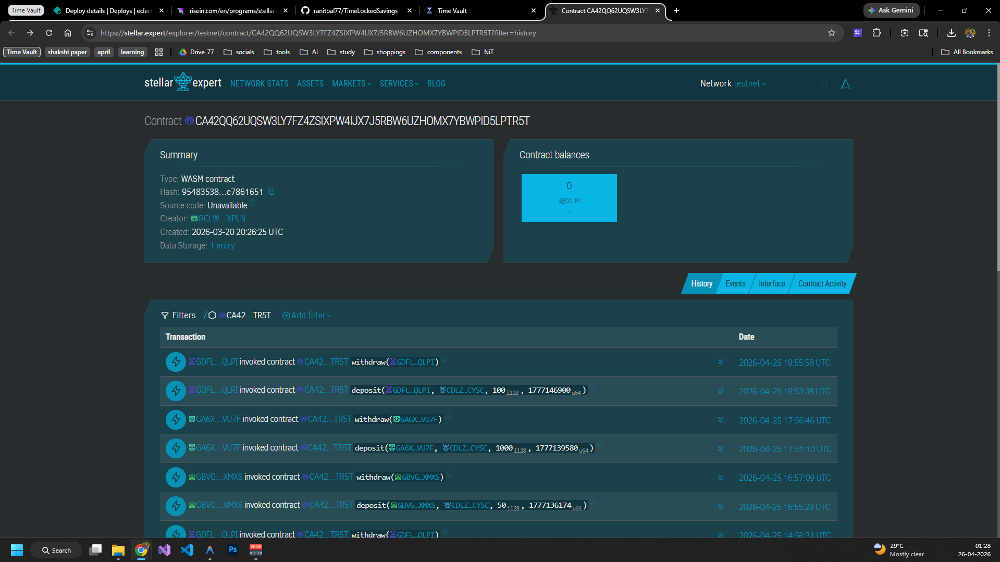
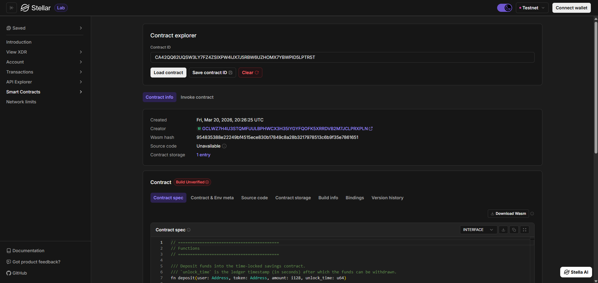
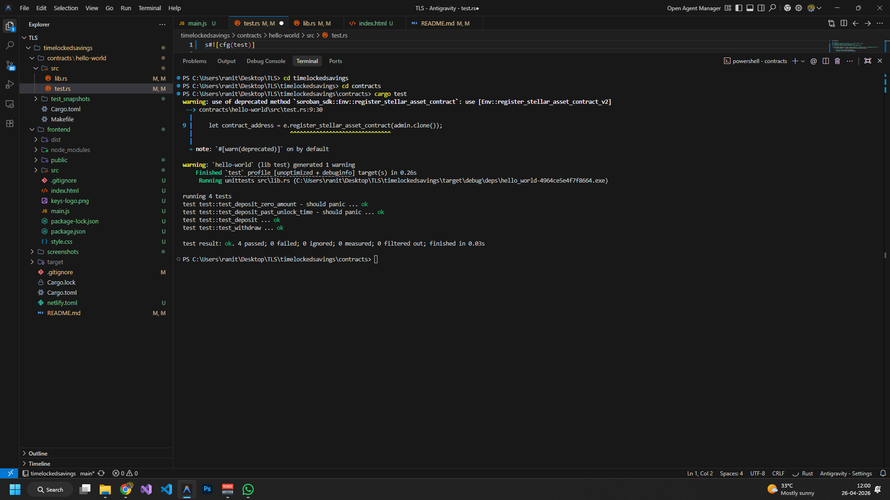
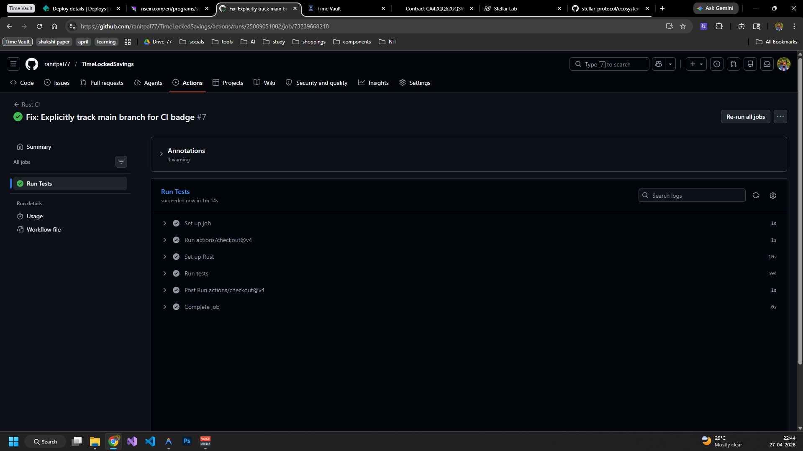
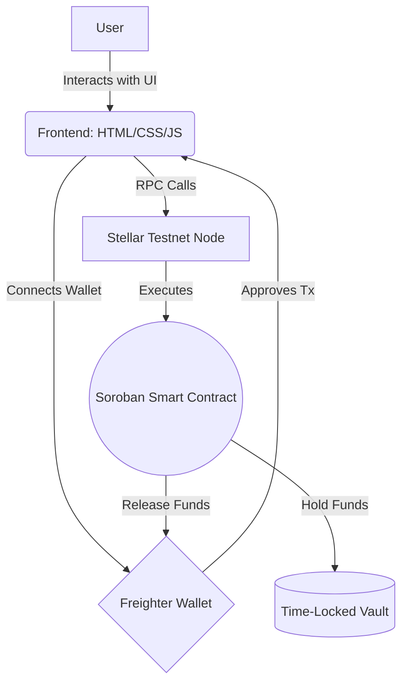

# ⏳ Time-Locked Savings dApp

[](https://github.com/ranitpal77/TimeLockedSavings/actions/workflows/test.yml)


## 📖 Project Description
The **Time-Locked Savings dApp** is a decentralized application built on the Stellar network utilizing Soroban Smart Contracts. It promotes disciplined saving mechanisms or delayed gratification by allowing users to securely lock up their Stellar assets (e.g., XLM, USDC, DAO tokens) for a predefined period. Once the funds are locked, they are cryptographically secured and strictly immobilized. The funds cannot be retrieved under any circumstances until the designated maturity timeline (ledger timestamp) has been reached.

## 🚀 What it does
1. **Connect Wallet:** Seamlessly pairs with the Freighter extension.
2. **Deposit & Lock:** Users interact with the smart contract directly via the UI, depositing a designated token amount. They can effortlessly set their lock duration (between 1 minute and 1 year) using an intuitive range slider or a precise numeric input.
3. **Secure Holding:** The immutable Soroban smart contract transfers the tokens from the user's wallet into its own decentralized custody.
4. **Maturity & Withdrawal:** Once the current ledger timestamp surpasses the user-specified unlock duration, the user can call the `withdraw` function to instantly reclaim their funds. Premature withdrawal attempts will be mathematically rejected by the underlying Soroban VM.

## ✨ Features
- **100% Permissionless Nature**: The core contract operates completely without a central admin or escrow agent. Any user can interact and generate their own lock timeline trustlessly.
- **Abstracted Complexity**: Locks represent precise Unix timestamps mathematically under the hood, but this is entirely hidden from the user interface.
- **Smart Duration Inputs**: Users flexibly manage lockups by dragging a responsive timeline slider, or by typing exact duration seconds to dynamically calculate real-time unlock calendar dates automatically.
- **Refined Glassmorphic UI**: Fast, responsive, dark-mode vanilla JS interface structured for an optimal user experience featuring expressive typography like *Big Shoulders Display*.

## 🔗 Deployed Smart Contract Link
**[View on Stellar Lab](https://lab.stellar.org/r/testnet/contract/CA42QQ62UQSW3LY7FZ4ZSIXPW4IJX7J5RBW6UZHOMX7YBWPID5LPTR5T)**

**[View Transaction on Stellar.Expert](https://stellar.expert/explorer/testnet/tx/c74b6efd527cc270b00e128b7fdd77d52a76eabfc4065d569ddf331fcde4858c)**

## 🆔 Contract ID 
`CA42QQ62UQSW3LY7FZ4ZSIXPW4IJX7J5RBW6UZHOMX7YBWPID5LPTR5T`

## 🧾 Transaction Hash
`954835388e22249bf4515ece830b17849c8a28b3217978513c6b9f35e7861651`

---

### 📸 Transaction Screenshot (Successful Testnet Transaction)


### 📸 Deployed Smart Contract Screenshot (Transaction hash)


### 📸 UI Screenshot


### 📸 Mobile Responsive View


### 📸 Test Output


### 📸 CI/CD Pipeline


---

## 🏗️ Architecture (High-Level Flow)


## 🛣️ Pipeline (Development Plan)

```mermaid
flowchart LR
    subgraph Phase 1: Planning
        A[Define Requirements] --> B[Architecture Design]
    end
    subgraph Phase 2: Smart Contracts
        B --> C[Develop Rust Contract]
        C --> D[Write Unit Tests]
    end
    subgraph Phase 3: Frontend
        D --> E[Design UI/UX]
        E --> F[Implement Vanilla JS]
    end
    subgraph Phase 4: Integration
        F --> G[Freighter Wallet Connect]
        G --> H[Soroban RPC Integration]
    end
    subgraph Phase 5: Finalization
        H --> I[GitHub Actions CI/CD]
        I --> J[Testnet Deployment]
    end
```


## 🛠️ Tech Stack
- **Smart Contract Ecosystem**: Rust, Soroban SDK
- **Network**: Stellar Testnet
- **App Frontend**: HTML5, CSS3 (Custom Glassmorphisim), Vanilla JavaScript (ES6) 
- **Build Tooling**: Vite
- **Wallet Integration**: `@stellar/freighter-api`
- **Blockchain Interaction API**: `@stellar/stellar-sdk`

## 🛠️ Setup Instructions (How to run locally)

### Prerequisites
- Node.js (v18 or higher recommended)
- Rust and Cargo (for smart contract compilation, optional for frontend)
- Freighter Wallet extension installed in your browser

### Running the Frontend
1. Clone the repository and navigate to the project directory.
2. Navigate to the frontend directory:
   ```bash
   cd frontend
   ```
3. Install the dependencies:
   ```bash
   npm install
   ```
4. Start the development server:
   ```bash
   npm run dev
   ```
5. Open the local URL provided by Vite in your browser.

## 📂 Project Structure
```text
Time-Locked-Savings/
├── contracts/
│   └── time_locked_savings/   # Core Soroban Smart Contract
│       ├── src/
│       │   ├── lib.rs         # The TimeLockedSavings Rust Contract logic
│       │   └── test.rs        # Contract Unit tests
│       └── Cargo.toml         # Rust dependencies
├── frontend/                  # Vanilla JS Frontend built with Vite
│   ├── docs/                  # Documentation sub-site
│   ├── index.html             # Main dApp Interface
│   ├── style.css              # Custom styling UI and animations
│   ├── main.js                # Stellar SDK and Freighter API interactions
│   ├── vite.config.js         # Vite build configuration
│   └── package.json           # Frontend dependencies 
└── README.md                  # Project documentation
```

## 🔮 Future Enhancements
- **Fee Sponsorship**: Implement gasless transactions using Stellar's fee bump feature so users do not need to hold native XLM just to pay for network fees.
- **Google Authentication**: Create user-specific integrations using Google Auth for streamlined account management and personalized experiences.
- **Website Improvements**: Make the dApp more functional and user-friendly by creating a dedicated navigation bar, adding a robust features page, and expanding the existing documentation pages.

## 🌐 Live Demo
[Live demo link](https://timevault.007575.xyz)

## 🎥 Demo Video
[MVP](https://drive.google.com/file/d/1UOkYQjGgEmQkywJZ5wpjTa1eESZlOQ_G/view?usp=sharing)

## 📝 Level 5 Feedbacks & Improvement Section
- [Level 5 user feedback (Responses)](https://docs.google.com/spreadsheets/d/1rvzfpsDSV-m4lZD0aDTtPeHgy4KvIEIp7fI9gz0iJlY/edit?usp=sharing)
- [Simple version of level 5 feedback form (including git commits)](https://docs.google.com/spreadsheets/d/1bJM-fENmiJJDckouTgFVd47WRLBnSs3UNX8JO2_X-1E/edit?usp=sharing)
- [Proper Documentaion](./level-5-feedback.md)
