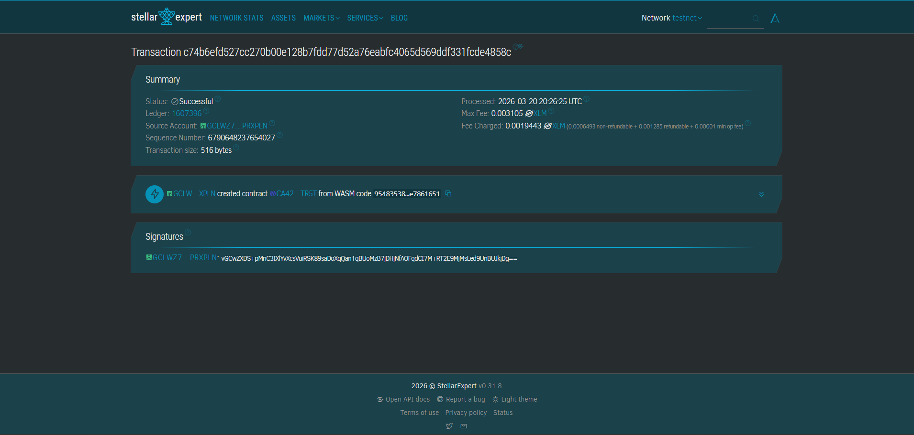
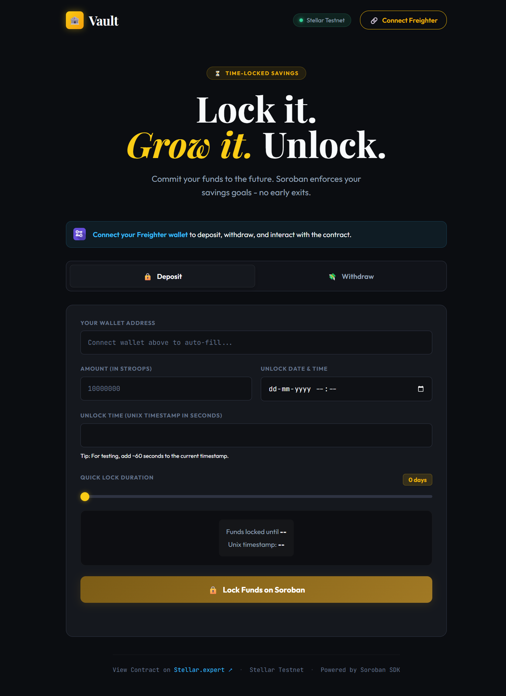

# ⏳ Time-Locked Savings dApp

## 📖 Project Description
The **Time-Locked Savings dApp** is a decentralized application built on the Stellar network utilizing Soroban Smart Contracts. It promotes disciplined saving mechanisms or delayed gratification by allowing users to securely lock up their Stellar assets (e.g., XLM, USDC, DAO tokens) for a predefined period. Once the funds are locked, they are cryptographically secured and strictly immobilized. The funds cannot be retrieved under any circumstances until the designated maturity timeline (ledger timestamp) has been reached.

## 🚀 What it does
1. **Connect Wallet:** Seamlessly pairs with the Freighter extension.
2. **Deposit & Lock:** Users interact with the smart contract directly via the UI, depositing a designated token amount. They can effortlessly set their lock duration (between 1 minute and 1 year) using an intuitive range slider or a precise numeric input.
3. **Secure Holding:** The immutable Soroban smart contract transfers the tokens from the user's wallet into its own decentralized custody.
4. **Maturity & Withdrawal:** Once the current ledger timestamp surpasses the user-specified unlock duration, the user can call the `withdraw` function to instantly reclaim their funds. Premature withdrawal attempts will be mathematically rejected by the underlying Soroban VM.

## ✨ Features
- **100% Permissionless Nature**: The core contract operates completely without a central admin or escrow agent. Any user can interact and generate their own lock timeline trustlessly.
- **Abstracted Complexity**: Locks represent precise Unix timestamps mathematically under the hood, but this is entirely hidden from the user interface.
- **Smart Duration Inputs**: Users flexibly manage lockups by dragging a responsive timeline slider, or by typing exact duration seconds to dynamically calculate real-time unlock calendar dates automatically.
- **Refined Glassmorphic UI**: Fast, responsive, dark-mode vanilla JS interface structured for an optimal user experience featuring expressive typography like *Big Shoulders Display*.

## 🔗 Deployed Smart Contract Link
**[View on Stellar Lab](https://lab.stellar.org/r/testnet/contract/CA42QQ62UQSW3LY7FZ4ZSIXPW4IJX7J5RBW6UZHOMX7YBWPID5LPTR5T)**

**[View Transaction on Stellar.Expert](https://stellar.expert/explorer/testnet/tx/c74b6efd527cc270b00e128b7fdd77d52a76eabfc4065d569ddf331fcde4858c)**

## 🆔 Contract ID 
`CA42QQ62UQSW3LY7FZ4ZSIXPW4IJX7J5RBW6UZHOMX7YBWPID5LPTR5T`

---

### 📸 Transaction Screenshot


### 📸 Deployed Smart Contract Screenshot


### 📸 UI Screenshot


---

## 🛠️ Tech Stack
- **Smart Contract Ecosystem**: Rust, Soroban SDK
- **Network**: Stellar Testnet
- **App Frontend**: HTML5, CSS3 (Custom Glassmorphisim), Vanilla JavaScript (ES6) 
- **Build Tooling**: Vite
- **Wallet Integration**: `@stellar/freighter-api`
- **Blockchain Interaction API**: `@stellar/stellar-sdk`

## 🔮 Future Enhancements
- **Yield Generation**: Integrate with Stellar DeFi lending pools (e.g., Blend) so locked assets accumulate interest during the vesting period.
- **Multi-Deposit Support**: Evolve the DataKey mapping structure to iterate and allow a single user to maintain multiple differently-timed lockboxes at once.
- **Penalty Logic**: Implement an "Emergency Withdraw" function that allows premature unlocking in exchange for a protocol fee/penalty burn.

## 📂 Project Structure
```text
Time-Locked-Savings/
├── contracts/
│   └── hello-world/           # Core Soroban Smart Contract
│       ├── src/
│       │   ├── lib.rs         # The TimeLockedSavings Rust Contract logic
│       │   └── test.rs        # Contract Unit tests
│       └── Cargo.toml         # Rust dependencies
├── frontend/                  # Vanilla JS Frontend built with Vite
│   ├── index.html             # Main dApp Interface
│   ├── style.css              # Custom styling UI and animations
│   ├── main.js                # Stellar SDK and Freighter API interactions
│   └── package.json           # Frontend dependencies 
└── README.md                  # Project documentation
```
